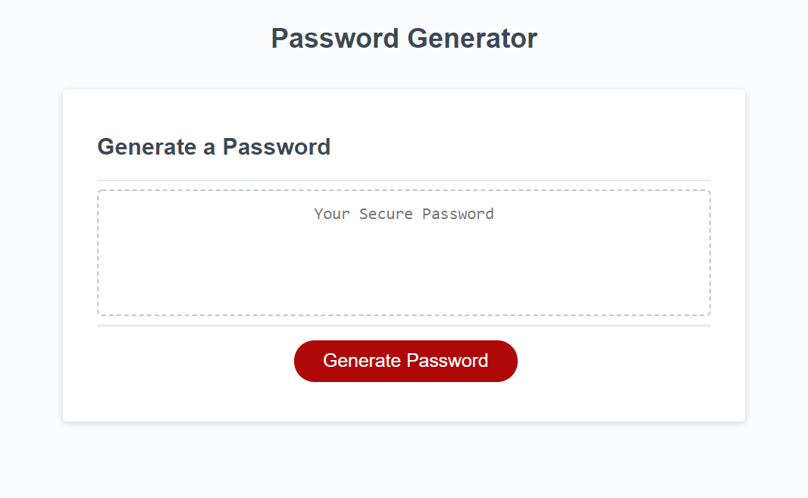
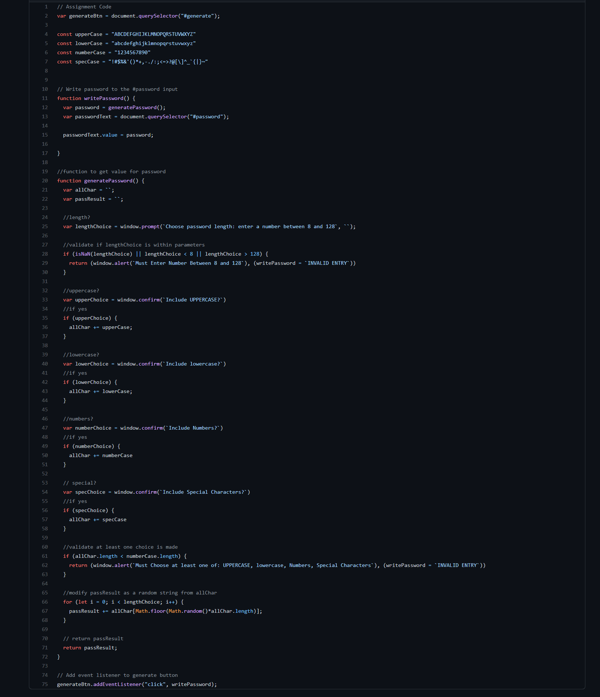

# Password Generator

Georgia Tech Full Stack Bootcamp - Homework 3

This project was a homework assignment for the Georgia Tech Full Stack Bootcamp and involved creating a password generator. (see full description below)


## Installation

Link to working site: 
 <https://pharaohnof.github.io/gtbc-homework3>

Clone the repository: 
 git clone https://github.com/pharaohnof/gtbc-homework3.git


## Description

 In this project I was given the follwing instructions:


## Your Task

This week’s homework requires you to modify starter code to create an application that enables employees to generate random passwords based on criteria that they’ve selected. This app will run in the browser and will feature dynamically updated HTML and CSS powered by JavaScript code that you write. It will have a clean and polished, responsive user interface that adapts to multiple screen sizes.

The password can include special characters. If you’re unfamiliar with these, see this [list of password special characters](https://www.owasp.org/index.php/Password_special_characters) from the OWASP Foundation.

## User Story

```
AS AN employee with access to sensitive data
I WANT to randomly generate a password that meets certain criteria
SO THAT I can create a strong password that provides greater security
```

## Acceptance Criteria

```
GIVEN I need a new, secure password
WHEN I click the button to generate a password
THEN I am presented with a series of prompts for password criteria
WHEN prompted for password criteria
THEN I select which criteria to include in the password
WHEN prompted for the length of the password
THEN I choose a length of at least 8 characters and no more than 128 characters
WHEN prompted for character types to include in the password
THEN I choose lowercase, uppercase, numeric, and/or special characters
WHEN I answer each prompt
THEN my input should be validated and at least one character type should be selected
WHEN all prompts are answered
THEN a password is generated that matches the selected criteria
WHEN the password is generated
THEN the password is either displayed in an alert or written to the page
```

## Mock-Up

The following image shows the web application's appearance and functionality:


## Result

I used javascript to code the required behaviors into the assword generator. All criteria were met. The following screenshots show the final product, and javascript code:


